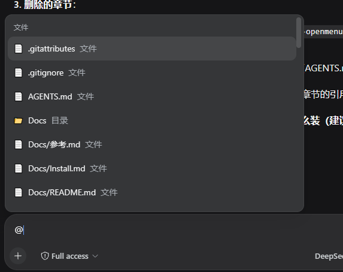

# dsh-quick-file

DSH plugin: **quick file input with `@`**.

Type `@` in the input box to get a file list of the workspace; press Enter or
click to insert the file path into the input (powered by the built-in input
trigger pipeline — the input box itself is untouched).

## Screenshot



## Install

```powershell
dsh plugin --profile web add "github:yzlin499/dsh-yzlin499-easy-plugins#path:/dsh-quick-file"
```

Restart DSH Web to activate.

> Or enable it quickly from the **dsh-yzlin499-plugins-manager** Plugin Manager card (Settings → Plugins).

## Usage

Type `@` in the input box → a menu appears (grouped with other `@` sources) →
keep typing to filter (fuzzy match on file name / path) → pick with ↑↓/Enter or
click → the picked item is inserted as a **chip**: only the file name is shown,
one Backspace deletes the whole chip, and on send it expands to the full
relative path for the model.

The candidate menu stretches to the full input-box width; each row shows a
**type icon + file name + containing directory**: icons are color-coded by
extension (e.g. blue for ts, yellow for js, yellow-blue for py, light blue for
go, orange for rs, purple for images, orange for archives), and overly deep
directory paths are truncated on the left, keeping only the tail closest to the
file name.

## Configuration (Settings → Plugins → Quick File Input)

| Item | Description |
|---|---|
| Everything HTTP | **Leave empty = recursive scan** of the workspace; fill in e.g. `http://127.0.0.1:8074` to search via the **Everything HTTP Server** instead (Everything already indexes the whole disk — faster than per-directory traversal) |
| Ignore dirs | Comma-separated directory names skipped by both search modes. Defaults to `node_modules,.git,dist,build,coverage,.next,.cache,__pycache__,.venv,venv,target,.dsh`; **clearing it ignores nothing** (the full Everything index becomes searchable, including `node_modules`) |
| Max list depth | Max directory depth for the recursive-scan mode (1-10, default 3) |
| Max file count | Max entries returned (10-200, default 50) |

The Everything mode reuses Everything's index: results are constrained to the
**current session workspace** (`path:` filter), cover everything already indexed,
and are fast. Which directories are ignored is controlled by the **Ignore dirs**
setting (by default `node_modules`/`.git` etc. are skipped so results stay
relevant); to search files under `node_modules`, remove that entry from the
ignore list or clear the field. Everything search runs when you type a keyword;
with an empty keyword the recursive scan is used instead (clean workspace
listing).

## How it works

- **Client** (`client.js`): registers an `@` InputTriggerSource into the built-in
  pipeline `dsh-client-ui-input-trigger` (`ctx.inputTriggers`) — menu rendering,
  keyboard navigation and input rewriting are handled by the pipeline; this
  plugin only provides the file data source.
- **Host** (`index.js`): `/quick-file/files` route — resolves the workspace root
  (`SessionHeader.cwd`) and returns the file list:
  - Without Everything configured, or with an empty keyword: recursively lists
    via the `fs` service (depth / ignore / count limited)
  - With Everything HTTP configured and a keyword: queries the
    `?search=...&j=1&path_column=1` JSON endpoint (workspace-scoped via `path:`,
    ignoring dirs per the `ignoreDirs` setting), falling back to the recursive
    scan on failure
- Config is persisted to `~/.dsh/settings.yaml` through the official
  `ctx.settings` service (namespace `dsh-quick-file`); the settings card
  reads/writes via the plugin's own `/quick-file/config` route.

## License

MIT
