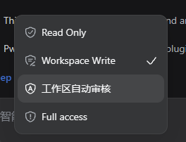

# dsh-workspace-auto-approval

DSH 插件：**工作区自动审核**。

它向 DSH 权限选择器新增第四种 **“工作区自动审核”** 模式。该模式沿用
`Workspace Write + ask` 的底层权限边界，但在审批链前增加自动审核：工作区内的操作、
工作区外的只读访问和网络读取可以自动通过；无法由简单规则可靠判断的命令或 MCP 调用，
会交给当前会话使用的 AI 做一次带工具定义、但不可调用工具的审核。普通 `Workspace Write`
模式保持原行为。

## 截图



## 安装

```powershell
dsh plugin --profile web add "github:yzlin499/dsh-yzlin499-easy-plugins#path:/dsh-workspace-auto-approval"
```

重启 DSH Web 后生效。

> 已安装 **dsh-yzlin499-plugins-manager** 时，也可以直接在
> 「设置 → 插件 → 插件管理」卡片一键启用。

## 使用

安装并重启后，在会话的权限选择器中选择 **“工作区自动审核”**。只有选中该模式时
插件才会处理权限升级请求；切回 `Workspace Write` 后，所有请求继续使用 DSH 原审批链。
自动审核模式按以下顺序判断：

| 情况 | 处理 |
|---|---|
| `write` / `edit` 的目标在当前工作区内 | 自动允许一次 |
| `pwsh` / `bash` 是明确的只读命令 | 自动允许一次，包括读取工作区外文件 |
| `curl` 使用简单白名单参数执行明确的网络 GET/HEAD | 自动允许一次 |
| 工作区内的 shell 写命令或其他无法由只读规则证明的命令 | 调用当前会话模型审核；仅回答 `ALLOW` 才自动允许 |
| 递归/通配批量删除、`git clean -fd`、删库/删表/清表及破坏性 MCP | 不进入 AI，交给 DSH 下游审批链，必须由用户判断 |
| 命中系统服务、注册表、用户管理、关机、网络上传等高风险规则 | 交给 DSH 原有下游审批链 |
| 简单规则无法判断 | 调用当前会话模型审核；仅回答 `ALLOW` 才自动允许 |
| AI 报错、超时、无可用模型或未明确允许 | 交给 DSH 原有下游审批链 |

插件只返回一次性授权 `allowed-once`，不会修改会话的持久权限模式。

## 设置

在「设置 → 插件 → 工作区自动审核」展开设置卡片，可以直接编辑 AI 审核使用的
System Prompt。支持保存和恢复默认，最多 8000 字符；配置由官方 `ctx.settings` 持久化到
`~/.dsh/settings.yaml` 的 `dsh-workspace-auto-approval.prompt`。

修改后的提示词从下一次 AI 审核起生效，不需要重启。高危大规模破坏规则在提示词之前
确定性执行，用户无法通过修改提示词绕过“必须交给用户判断”的限制。

## 工作原理

- Bundle 补丁重述官方三种权限预设，并追加 `workspace-auto-approval`。它与
  `workspace-write` 共用 `sandbox: workspace-write`、`approval: ask`，DSH 通过持久的
  `permission/preset` 事件区分用户选中了哪一种。
- Host 插件以 `prepend` 方式监听 `approval/request`，但仅在当前预设为
  `workspace-auto-approval` 时介入；其他模式立即调用 `next()`。
- Client 半侧为该预设补充与官方一致的 16×16 “盾牌 + A” SVG 图标。官方
  `PresetOption` 没有图标字段，因此 Client 只匹配完整标签“工作区自动审核”，通过 CSS
  SVG mask 装饰当前模式按钮和菜单项；不修改官方包，卸载时自动清理。独立源文件见
  `icon.svg`。
- 审批请求只带 `callId`，插件从当前 Session 的 `tool/call` 事件中按该 ID 取回原始参数。
- 工作区边界来自 `session.header.cwd`；路径比较会解析已存在的符号链接/目录连接，避免只做
  字符串前缀判断。
- Host 用官方 `ctx.settings` 注册 `dsh-workspace-auto-approval` 命名空间，设置卡片通过
  `/workspace-auto-approval/config` 读写提示词；每次 AI 审核都读取最新值。
- 本地规则优先：结构化文件目标、命令工作目录、绝对路径、父目录跳转、动态路径、只读命令、
  网络读写和常见系统级副作用分别判断。shell 写命令不会仅凭文本路径被本地规则放行，
  因为变量、通配符和可变符号链接无法由字符串检查可靠约束。
- AI 兜底复用当前会话最近一次请求的 provider/model，发送工作区、审批理由、匹配到的
  工具定义（名称、描述、参数 schema）和本次实际参数，JSON 输入上限为 32 KiB。这使名称
  不透明的 MCP 工具也能结合定义判断读写性质。请求仍显式设置 `tools: []`，审核模型只能
  阅读 schema，不能调用任何工具，也不携带会话历史。
- 审核请求允许推理：优先沿用当前会话已启用的 `reasoningEffort`；未启用时查询模型能力，
  自动选择第一个非关闭档位（DeepSeek 通常为 `low`）。模型不支持推理时不传该字段。
  `maxTokens: 256` 为隐藏推理预留空间，超时仍为 15 秒。
- AI 只有完整输出 `ALLOW` 才能授权；任何其他输出和异常都调用 `next()`，回落到 DSH 原有
  审批链。若会话审批策略是 `never`，DSH 会按原策略拒绝回落请求。

## 安全边界

`danger-full-access` 命令一旦被允许，底层执行器不会继续强制限制其文件效果。插件通过规则和
AI 判断命令意图，但无法像操作系统沙箱一样证明任意 shell 脚本的所有运行时副作用。因此：

- 大规模破坏规则在 AI 前执行，批量删文件、递归强删、删库/删表/清表等不会因自定义提示词
  或 AI 输出而自动授权；
- 明确的主机配置修改和网络上传也不会自动通过；
- MCP 工具 schema、审批理由和实际参数会发送给当前会话使用的模型提供商；参数中含有敏感
  信息时，应把这视为一次对该提供商的数据披露；
- AI 不是安全边界，生产环境或无人值守环境应保留 DSH 沙箱，并按风险决定是否安装本插件。

## 测试

```powershell
cd dsh-workspace-auto-approval
npm test
```

## License

MIT
