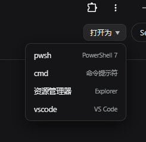

# dsh-workspace-openmenu

DSH 插件：**工作区快捷打开菜单**。在会话头部右上角（session log 按钮左侧）
加一个「打开为」按钮，二级菜单在工作区位置打开：**pwsh / cmd / 资源管理器 / vscode**。

## 截图



## 安装

```powershell
dsh plugin --profile web add "github:yzlin499/dsh-yzlin499-easy-plugins#path:/dsh-workspace-openmenu"
```

重启 DSH Web 后生效。

> 或者：直接通过 **dsh-yzlin499-plugins-manager** 的「插件管理」卡片（设置 → 插件）快速启用。

## 使用

打开任意工作区会话 → 右上角（session log 左侧）出现「打开为」按钮 →
下拉选择：**pwsh**（新 PowerShell 7 窗口）、**cmd**（新命令提示符窗口）、
**资源管理器**（Explorer 窗口）、**vscode**（VS Code 打开该目录）。

目标目录 = 当前会话的工作区根目录（`SessionHeader.cwd`）；会话无工作区时提示错误。

## 工作原理

- **Client**（`client.js`）：注册进 `conversation.session.header.utilities` 插槽
  （右对齐会话工具区，`order: -10` 排在 session-log 按钮左侧）；按钮 + 下拉菜单，
  点击项 POST `/workspace-open/open`。
- **Host**（`index.js`）：`/workspace-open/open` 按会话 cwd 启动应用——
  explorer 直接 spawn；pwsh / cmd 经 `cmd /c start` 开独立新窗口；
  vscode 优先定位 `Code.exe`（`%LOCALAPPDATA%\Programs\Microsoft VS Code` 等）直接
  启动，找不到回退 `code` 命令。

## License

MIT
