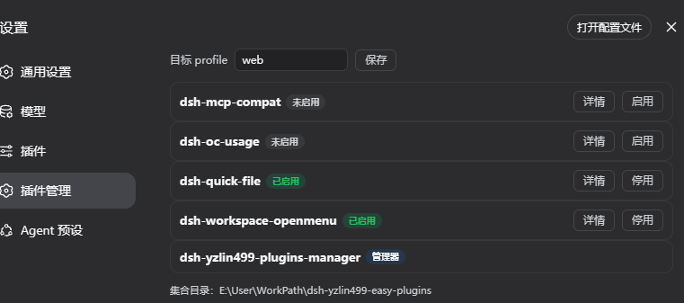

# dsh-yzlin499-plugins-manager

DSH 插件管理器：在官方**设置 → 插件 →「插件管理」卡片**里统一管理默认集合和自定义目录中的插件。

## 截图



## 功能

- 自动扫描管理器所在文件夹（默认集合根）下所有含 `cordis.patch.yml` 的插件
- 可在设置卡片中添加多个自定义集合根目录，统一管理其它路径中的插件
- 自定义目录和目标 profile 通过官方 settings 持久化到 `~/.dsh/settings.yaml`
- 显示每个插件的启用状态（以 `dsh.profile.bundles` 挂载清单为准）
- 一键启用/停用：通过 `dsh plugin add/remove` 命令执行，可批量开关后一次性重启生效
- 详情弹窗显示插件 README（中文界面读 `README.md`；英文界面优先 `README_EN.md`、缺失则回退 `README.md`；两者都没有时显示 `package.json.description`）
- 目标 profile 默认 `web`，可在面板修改并持久化

## 边界

- **只管理默认集合和用户明确添加的集合目录**，不会扫描其它位置
- 自定义路径必须是现存的绝对目录；每个集合根只扫描含 `cordis.patch.yml` 的直接子文件夹
- 多个集合中出现相同 `package.json.name` 时标记为“同名冲突”并禁用开关，避免误卸载另一来源
- 从管理列表移除自定义目录不会卸载该目录中已经启用的插件
- 管理器自身不可被停用（防止把自己锁死）
- 失效链接自愈：旧工程残留的链接会自动 remove 后用当前集合路径重装

## 安装

```powershell
dsh plugin --profile web add ./dsh-yzlin499-plugins-manager
```

重启 DSH Web 后，设置 → 插件 →「插件管理」卡片即可使用。

## License

MIT
